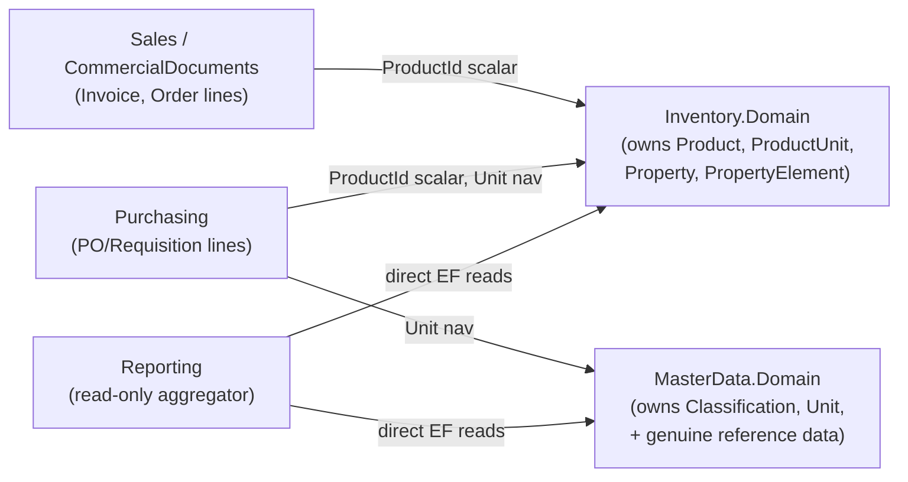
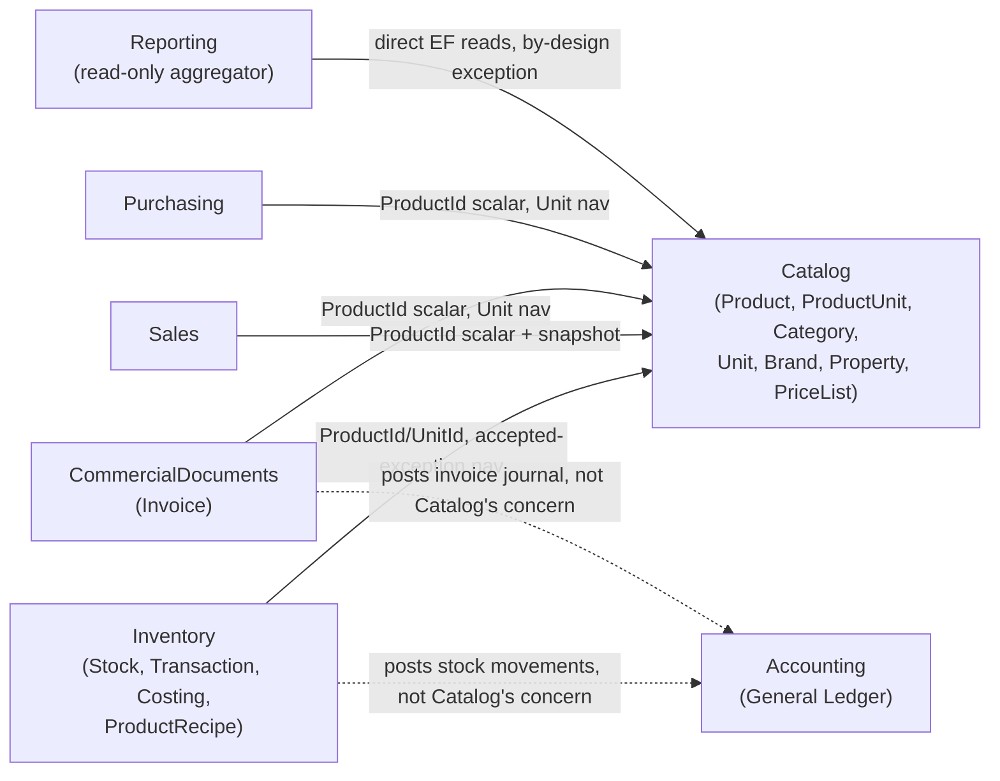

# Catalog Bounded Context — Migration Result

Companion to `catalog-current-state.md` (Phase 0), `catalog-target-architecture.md` (Phase 1),
`catalog-ownership.md`, and `catalog-data-migration-plan.md`. Reports what was actually built,
verified against a real `dotnet build`/`dotnet test` run of the whole solution, not claimed.

## 1. Summary

Built the **Catalog** bounded context as the authoritative Product/Category/Unit/Brand/Attribute/
PriceList master-data owner, by **physically relocating** `Product`, `ProductUnit`, `Classification`,
`Unit`, `Property`, `PropertyElement`, `ProductPropertyElement` out of `Inventory.Domain`/
`MasterData.Domain` into the new `Catalog.Domain`/`Catalog.Application` (zero schema diff, verified
by a generated EF migration whose `Up()` contains no `DropTable`/`DropColumn`/`RenameTable` for any
relocated entity — only genuinely new columns/tables), and adding real net-new capability (`Brand`,
`PriceList`/`PriceListEntry`, `Product.ProductType`, `Property.DataType`, price resolution). Every
consuming module (Inventory, Purchasing, CommercialDocuments, Sales, Treasury, Reporting, the legacy
`OrgSys` MVC project, and `API`) was updated to reference Catalog instead. The full solution builds
with 0 errors and the entire test suite (1,802 tests across 10 projects, including 1,376 architecture
tests) passes.

## 2. Files created

- `Modules/Catalog/Catalog.Domain/**` — `Catalog.Domain.csproj`, `GlobalUsings.cs`,
  `AssemblyMarker.cs`, `Exceptions/CatalogDomainException.cs`, `Enums/ProductType.cs`,
  `Enums/AttributeDataType.cs`, `Entities/Brand.cs`, `Entities/PriceList.cs`,
  `Entities/PriceListEntry.cs` (Product/ProductUnit/Classification/Unit/Property/PropertyElement/
  ProductPropertyElement/TrackingType/CostingMethod are *relocations*, listed in §4).
- `Modules/Catalog/Catalog.Application/**` — `Catalog.Application.csproj`, `GlobalUsings.cs`,
  `AssemblyMarker.cs`, root `MappingProfile.cs`, full CQRS for `Brands/` and `PriceLists/` (new),
  `Pricing/Queries/ResolvePriceQueryHandler.cs` (new).
- `Modules/Catalog/Catalog.Infrastructure/**` — `Catalog.Infrastructure.csproj`, `GlobalUsings.cs`,
  `DependencyInjection/ServiceCollectionExtensions.cs` (`AddCatalogModule()`).
- `Modules/Catalog/Catalog.Contracts/**` — `Catalog.Contracts.csproj`, `GlobalUsings.cs`,
  `Pricing/ResolvePriceQuery.cs`, `Pricing/ResolvedPriceDto.cs` (new); `Products/
  GetProductNamesQuery.cs` (relocated from `Inventory.Contracts`).
- `API/Controllers/Org/Catalog/BrandController.cs`, `PriceListController.cs`,
  `PricingController.cs` — new API surface for the genuinely new capabilities.
- `BuildingBlocks/OrgSys.DatabaseMigrator/Migrations/20260915070850_RelocateCatalogEntities.{cs,Designer.cs}`
  — generated migration (see §14).
- `Tests/Application.Tests/ResolvePriceQueryHandlerTests.cs` — 3 tests for price resolution.
- `docs/catalog/{catalog-current-state,catalog-target-architecture,catalog-ownership,catalog-data-migration-plan,catalog-migration-result}.md`
  — this document set.

## 3. Files deleted

**None.** Every relocation used `git mv` (or plain `mv` for two untracked WIP files) followed by an
in-place namespace edit — no file's content was discarded, and no table was dropped. `git status`
shows 57 renamed+edited files, 45 modified-in-place files (csproj/GlobalUsings/OrgContext/
Architecture.Tests/controllers), 65 new files, and 0 deletions.

## 4. Legacy entities relocated (zero schema diff)

| Entity | From | To |
|---|---|---|
| `Product`, `ProductUnit` | `Inventory.Domain` | `Catalog.Domain` |
| `Property`, `PropertyElement`, `ProductPropertyElement` | `Inventory.Domain` | `Catalog.Domain` |
| `TrackingType`, `CostingMethod` (enums) | `Inventory.Domain.Enums` | `Catalog.Domain.Enums` |
| `Classification`, `Unit` | `MasterData.Domain` | `Catalog.Domain` (C# class names kept — see target-architecture §1) |
| Product/ProductUnit/Property/Classification/Unit CQRS (Commands/Queries/DTOs/MappingProfiles/Validators) | `Inventory.Application`, `MasterData.Application` | `Catalog.Application` |
| `GetProductNamesQuery` | `Inventory.Contracts` | `Catalog.Contracts` |

`ProductRecipe` was deliberately **not** relocated — stays Inventory-owned (BOM/costing composition,
not product definition; see `catalog-ownership.md`). `GetListProductByBalanceQuery`/
`GetListByBalanceQueryHandler` was deliberately moved to (and stays in) `Inventory.Application`, not
Catalog — it computes an Inventory-side stock balance from `TransactionProduct`, reaching
`Catalog.Domain.Product`/`Catalog.Application.ProductDto` the same accepted-exception way every
other Inventory query does.

## 5. Tables migrated

`Product`, `ProductUnit`, `Property`, `PropertyElement`, `ProductPropertyElement`, `Classification`,
`Unit` — all 7 kept their exact physical table names, column names, and row data; only their owning
C# project changed. Confirmed zero-diff by generating an EF migration and inspecting `Up()`: it
contains no `DropTable`/`RenameTable`/`DropColumn` for any of the 7.

## 6. New aggregates / entities

`Brand` (new), `PriceList` + `PriceListEntry` (new, `PriceList` is its own aggregate root — not a
`Product.PriceLists` collection — so Pricing can be extracted to its own module later without
touching Product).

## 7. New/changed value fields

`Product.ProductType` (enum, new — `StockItem`/`NonStockItem`/`Service`), `Product.BrandId`/`Brand`
nav (new, optional), `Property.DataType` (enum, new — defaults to `Selection`, preserving every
existing row's current implicit behavior).

## 8. Commands (new)

`CreateBrandCommand`, `UpdateBrandCommand`, `DeleteBrandCommand`, `DeleteListBrandCommand`,
`CreatePriceListCommand`, `UpdatePriceListCommand`, `DeletePriceListCommand`,
`DeleteListPriceListCommand`. (Product/Category/Unit/Attribute commands are relocations of
already-existing commands, not new.)

## 9. Queries (new)

`GetByIdBrandQuery`, `GetListBrandQuery`, `SearchBrandQuery`, `GetByIdPriceListQuery`,
`GetListPriceListQuery`, `SearchPriceListQuery`, `ResolvePriceQuery` (Contracts-level, for
cross-module price resolution — Sales/Purchasing should call this instead of reading
`Product.Price`/`PriceListEntry` directly, though no caller was wired up in this pass — see §18).

## 10. Domain events

**None added.** No new domain events were introduced for Catalog — Product/Category/Unit/Brand use
the same plain-CRUD, no-factory-method construction style they already had before relocation (see
target-architecture §2), matching Product's own pre-existing doc comment explaining why it "keeps
its existing AutoMapper-CRUD shape rather than becoming a Custody-style factory aggregate." Adding
domain events without real business logic to raise them from would have been exactly the "creating
events simply because CRUD happened" the brief itself warns against (Phase 11).

## 11. Integration events

**None wired up.** `Catalog.Contracts` does not yet define `ProductCreatedIntegrationEvent`/etc.
because, per the target-architecture's own analysis (§6), zero other modules currently need to react
to product changes — every existing consumer reads Catalog by ID/query, not by subscribing to
events. Documented as a deliberate deferral, not an oversight — the seam (per-module
`IIntegrationEventPublisher`, already used by CommercialDocuments/Accounting/Treasury) is proven and
ready whenever a real subscriber appears.

## 12. Context dependencies removed

`Inventory.Domain`/`Inventory.Application` and `MasterData.Domain`/`MasterData.Application` no
longer own or reference `Product`/`ProductUnit`/`Property`/`PropertyElement`/
`ProductPropertyElement`/`Classification`/`Unit` at all — those consumers now depend on
`Catalog.Domain`/`Catalog.Application`/`Catalog.Contracts` instead, following the exact same
"relocate + accepted-exception" pattern already proven by the `Parties` (Dealer) and
`CommercialDocuments` (Invoice) extractions.

## 13. Compatibility adapters remaining

**None needed.** Because the relocation preserved table names, column names, and the C# class names
of `Classification`/`Unit`/`Product` (see target-architecture §1's rationale), every existing
consumer needed only a `using`/project-reference change, not a shim. No `// TODO CATALOG-MIGRATION`
markers exist anywhere in the codebase.

## 14. Database migrations

One migration generated: `20260915070850_RelocateCatalogEntities`. Contains:
- `Up()`: `AddColumn(Property.DataType)`, `AddColumn(Product.BrandId)`, `AddColumn(Product.ProductType)`
  + a `Sql()` backfill (`UPDATE Product SET ProductType = 1 WHERE TrackingType = 0`, matching
  `catalog-data-migration-plan.md` §2's rule exactly), `CreateTable(Brand)`,
  `CreateTable(PriceList)`, `CreateTable(PriceListEntry)`, plus indexes/FKs. **No** `DropTable`/
  `DropColumn`/`RenameTable` for any relocated entity.
- A first scaffold attempt (before `ProductRecipe` was given back an explicit `DbSet<>` in
  `OrgContext`) produced a `DropTable(ProductRecipe)` and EF's own "may result in data loss"
  warning — caught before proceeding, root-caused (removing `Product.ProductRecipes` orphaned
  `ProductRecipe` from the EF model since its only prior discovery path was that one navigation,
  the `DbSet<>` having been commented out already), fixed by adding an explicit
  `DbSet<Inventory.Domain.ProductRecipe>` plus a Fluent "no navigation" FK config restoring the
  original relationship, and regenerated clean. See `OrgContext.cs`'s `ConfigureCatalog` method for
  the fix and its comment.
- **Not applied to the live database.** `OrgConnection` is a live remote DB (standing project
  constraint); `dotnet ef database update` was never run. One read-only side effect occurred:
  `dotnet ef migrations remove` (used to discard the first, flawed scaffold) connects to the target
  database to check `__MigrationsHistory` before removing a migration — this executed three
  `SELECT` statements against the live DB (confirmed from the command's own log output) but no
  schema or data change. Flagged here for transparency; applying the corrected migration requires
  separate, explicit user approval.

## 15. Tests added

- `Tests/Application.Tests/ResolvePriceQueryHandlerTests.cs` — 3 tests (falls back to
  `Product.Price` with no matching entry; picks an active, currently-valid `PriceListEntry`;
  returns `NotFound` for an unknown product).
- `Tests/Architecture.Tests/ModuleDependencyTests.cs` / `ModuleLayerDependencyTests.cs` — `Catalog`
  registered in both `ModuleDomains`/`ModuleApplications` arrays, plus 7 new documented
  `AcceptedDomainExceptions`/`AcceptedApplicationDomainExceptions`/
  `AcceptedApplicationApplicationExceptions` entries (every one derived from an actual NetArchTest
  failure, not guessed — see §16).

No new domain-unit-test project (`Catalog.Domain.Tests`) was added: Catalog's relocated entities use
the plain-property CRUD style (no factory methods, no invariant-throwing behavior methods) that
`Product`/`Classification`/`Unit` already had, so there is no domain *behavior* to unit-test the way
`Payables.Domain.Tests`/`Receivables.Domain.Tests` test `Payable.Apply()`/`Receivable.Settle()` — the
equivalent coverage (required-field, uniqueness invariants) lives in FluentValidation validators,
which is where `CreateBrandCommandValidator`/`UpdateBrandCommandValidator` were added. Validator unit
tests were not added in this pass — flagged as remaining work in §18.

## 16. Test results

```
Accounting.Domain.Tests      54 passed
Payables.Domain.Tests        35 passed
Receivables.Domain.Tests     35 passed
Advances.Domain.Tests        39 passed
Sales.Domain.Tests           53 passed
Inventory.Domain.Tests       66 passed
Purchasing.Domain.Tests      45 passed
Application.Tests            96 passed  (includes the 3 new Catalog pricing tests)
Inventory.Integration.Tests   3 passed
Architecture.Tests         1376 passed  (includes Catalog's new module registration + exceptions)
------------------------------------
Total                      1802 passed, 0 failed, 0 skipped
```

## 17. Build result

`dotnet build OrgSys.sln` — **0 errors**, 36-68 pre-existing warnings (npm audit advisories from
`OrgSys.Angular`'s esproj, and a handful of pre-existing nullable-annotation/using-directive
warnings in the legacy `OrgSys` project) — none introduced by this change. Verified twice: once
immediately after all consumer code compiled, once again after generating the EF migration and
adding the Brand/PriceList API controllers.

## 18. Remaining technical debt / deliberately deferred work

1. **Angular integration not started.** Per the brief's own Phase 20/22 sequencing ("update Angular
   integration only after backend contracts stabilize"), this was deliberately left for a follow-up
   pass. Concretely: `features/administration/products/` still points at the existing `/Product`
   route (unchanged, still works — no regression); `Category` (`Classification`) and `Unit` still
   have no dedicated Angular CRUD screen (they were lookup-only stubs before this work too — not a
   regression, just not newly fixed); `Brand`/`PriceList` have zero Angular presence.
2. **Existing `Setting/*Controller.cs` API routes kept as-is** (`/Product`, `/Classification`,
   `/Unit`, `/Property`) rather than moved under a `/Catalog` area — only their `using` statements
   were repointed at `Catalog.Application`. Reorganizing them now would force a simultaneous Angular
   route change, which is exactly the work item above; the new `Brand`/`PriceList`/`Pricing`
   controllers were given the `/Catalog` area name as the pattern for that future reorganization.
3. **`ResolvePriceQuery` has no caller yet.** Sales/Purchasing still read `Product.Price` (the
   brief's own explicitly-allowed "default/simple price" fallback) rather than resolving through a
   `PriceListId`. Wiring a real caller is future Sales/Purchasing work, not Catalog's.
4. **No unique constraint added on `Barcode`.** Per `catalog-current-state.md` §8 risk #5 — adding
   one now, without first checking existing data for duplicates, could fail against live data.
   Needs a data-quality check before it can be added safely.
5. **No `ProductVariant`, no multi-barcode-per-product, no Category hierarchy, no global UOM
   dimension grouping.** All confirmed-deferred by the user (2026-09-15) — no evidence of real
   business need for any of them in this codebase today (see `catalog-ownership.md`'s deferred
   table).
6. **Validator unit tests not added** for `CreateBrandCommandValidator`/`UpdateBrandCommandValidator`
   /`CreateClassificationCommandValidator`/etc.
7. **Migration not applied to the live database** — see §14. This is the single most
   consequential remaining step and requires explicit user approval before running
   `dotnet ef database update`.
8. **Phase 33's "search the whole repo again for leftovers" was done at the grep level during
   development** (confirming zero remaining `Inventory.Domain.Product`/`MasterData.Domain.
   (Classification|Unit)` references anywhere, migrations/snapshot files excluded since those are
   string-literal EF bookkeeping regenerated by `dotnet ef migrations add`) but not written up as
   a separate leftover-classification table — the "legacy" and "relocated" columns in
   `catalog-current-state.md` §7 and this document's §4 together cover the same ground.

## 19. Deliberate deviations from the brief

1. **`Classification`/`Unit` C# class names were kept**, not renamed to `Category`/`UnitOfMeasure`
   — documented and justified in `catalog-target-architecture.md` §1 (minimizes churn across ~15
   consumers, matches the zero-rename precedent `Dealer`/`Invoice` set during their own
   extractions).
2. **No strongly-typed IDs** (`ProductId`, `CategoryId`, etc.) — the brief allows this
   ("Do not introduce strongly typed IDs if all migrated contexts deliberately use another
   established convention... consistency with OrgSys is more important") and confirmed by discovery
   that zero modules in this codebase use them.
3. **No per-aggregate repository interfaces** (`IProductRepository`, etc.) for the relocated
   master-data entities — they use the generic `OrgSys.SharedKernel.IRepository<T>` directly,
   exactly as `Product`/`Classification`/`Unit` already did before relocation. The brief's rule #13
   ("do not create a new UnitOfWork/Repository implementation if OrgSys already provides one")
   applies here in the "don't fight the existing convention" direction.
4. **Generic CRUD base-class handlers were kept/extended** (`CreateCommandHandler<TDto,TModel>`
   etc. from `OrgSys.SharedKernel`) for Product/Category/Unit/Brand/Property, rather than
   hand-written bespoke handlers — per the brief's own rule #2 escape valve ("generic infrastructure
   helpers can remain where appropriate, but business behavior must be explicit"), and because
   these entities have no explicit lifecycle behavior beyond field updates (unlike `Payable`/
   `Receivable`, which do and therefore use bespoke factory-method aggregates).
5. **`ProductVariant`/multi-barcode/Category-hierarchy/global-UOM-dimension-grouping deferred** —
   user-confirmed (2026-09-15), documented in `catalog-ownership.md`.
6. **No integration events wired up** — see §11.
7. **Migration generated but not applied** — see §14, standing DB-safety constraint for this
   session.

## 20. Before / after architecture

**Before:**



**After:**



Catalog now defines **what** a product is; Inventory still defines **where it is and how much
exists**; Sales/Purchasing still define how it's sold/bought; General Ledger still defines the
financial consequences — unchanged from the brief's own target diagram, with Catalog now real
instead of theoretical.
